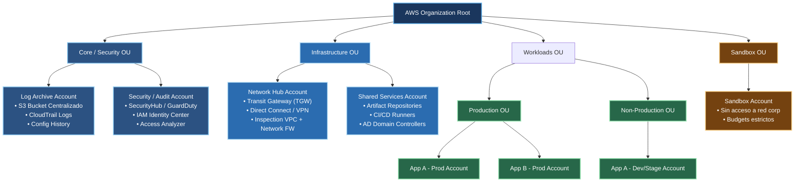
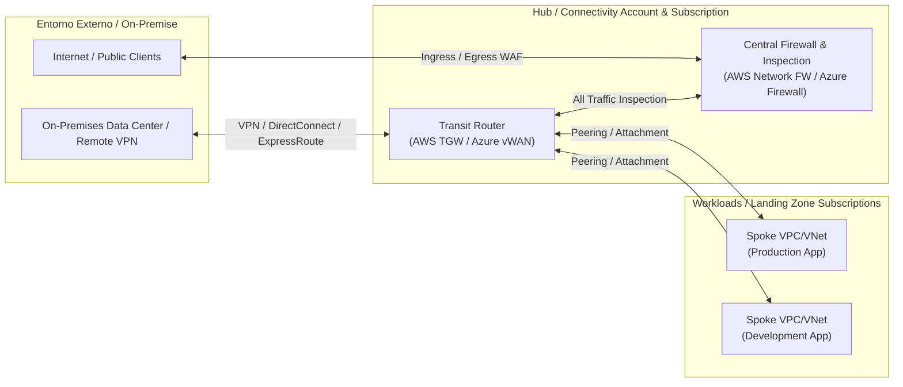

# Arquitectura de Landing Zone

## Visión general

La Landing Zone de AWS define la estructura organizacional y de cuentas para apoyar procesos de seguridad, gobernanza, networking y workloads en una empresa. Su propósito es crear un modelo seguro, escalable y consistente desde el inicio, donde cada cuenta y cada OU tienen una responsabilidad clara.

## Organización de cuentas y OU

- Root / Organización: es el nivel superior de AWS Organizations (Organización de AWS). Aquí se definen las políticas globales, la administración centralizada y la estructura general de la empresa en AWS.
- Core / Security OU: concentra los servicios de control, seguridad y auditoría. Es la base del cumplimiento y la observabilidad.
  - Log Archive Account: almacena y centraliza los logs de auditoría, incidentes y trazabilidad. Es la cuenta de retención para actividades como CloudTrail (registro de eventos de la cuenta), Config (estado de configuración) y almacenamiento seguro en S3 (Simple Storage Service).
  - Security / Audit Account: centraliza funciones de detección y seguridad. Aquí se ejecutan servicios como SecurityHub, GuardDuty, IAM Identity Center y Access Analyzer.
- Infrastructure OU: agrupa la infraestructura compartida y la red de la empresa. Permite que servicios críticos, redes y conectividad queden centralizados.
  - Network Hub Account: es la cuenta de conectividad de la organización. Tiene el enfoque de red, interconexión, gateway y seguridad de tráfico.
  - Shared Services Account: actúa como soporte común para la compañía. Aquí se centralizan repositorios de artefactos, runners de CI/CD (Continuous Integration / Continuous Deployment) y controladores de dominio compartidos.
- Workloads OU: separa los sistemas de negocio por criticidad y entorno. Es la capa donde viven las aplicaciones y servicios que entregan valor a la organización.
  - Production OU: contiene los entornos productivos, con acceso y criticidad más alta. Incluye App A - Prod Account y App B - Prod Account.
  - Non-Production OU: agrupa los entornos de desarrollo, pruebas y validación. Ejemplo: App A - Dev/Stage Account.
- Sandbox OU: es un espacio aislado para experimentación, aprendizaje y pruebas sin afectar la red corporativa ni la producción.
  - Sandbox Account: cuenta con restricciones de acceso y budgets exigentes para limitar riesgos.

### Siglas y acrónimos utilizados

- OU: Organizational Unit (Unidad Organizacional).
- S3: Simple Storage Service.
- IAM: Identity and Access Management (Gestión de identidad y acceso).
- TGW: Transit Gateway.
- VPC: Virtual Private Cloud (Nube privada virtual).
- CI/CD: Continuous Integration / Continuous Deployment (Integración y entrega continua).
- AD: Active Directory.
- AWS: Amazon Web Services.
- Dev: Development (Desarrollo).
- Stage: Staging (Preproducción).
- Prod: Production (Producción).

## Diagrama principal

## Diagrama de conectividad centralizada

### Explicación del diagrama de conectividad

- Entorno externo / On-Premise: representa la red corporativa o centros de datos remotos que se conectan a la nube mediante VPN, Direct Connect o ExpressRoute.
- Internet / Public Clients: representa clientes públicos o usuarios externos que acceden a servicios expuestos.
- Hub / Connectivity Account & Subscription: es la capa central de conectividad, donde se concentra el tráfico de entrada y salida a la nube.
- Transit Router (AWS TGW / Azure vWAN): actúa como el componente central de interconexión entre redes y workloads. Coordina el tránsito entre las redes de la organización.
- Central Firewall & Inspection: es el punto de inspección de tráfico. Permite aplicar seguridad, filtrado, inspección y control para todo el tráfico antes de llegar a los spokes.
- Workloads / Landing Zone Subscriptions: son los spoke networks o subredes que contienen las aplicaciones productivas y de desarrollo.
- Spoke VPC/VNet (Production App): representa la red de la aplicación en producción conectada al hub para acceder a servicios internos y públicos.
- Spoke VPC/VNet (Development App): representa el entorno de desarrollo con conectividad al hub, pero con políticas y aislamiento adecuadas.

## Explicación por componente del diagrama

### AWS Organization Root
Es el nodo raíz de toda la estructura en AWS Organizations. Desde aquí se administran las políticas, las OU (Unidades Organizacionales) y la distribución de cuentas. Es la base de gobierno de la nube.

### Core / Security OU
Es la unidad organizacional dedicada a la seguridad y la auditoría. Aporta visibilidad, control y trazabilidad a toda la organización.

### Log Archive Account
Es la cuenta de retención y almacenamiento central. Aquí se guardan los logs que permiten evidenciar actividades, cambios y eventos de seguridad. Tiene sentido propio porque mantiene la auditoría aislada del negocio y evita que los logs queden mezclados con workloads operativos.

### Security / Audit Account
Es la cuenta de vigilancia y análisis. Es el centro para herramientas de seguridad, detección de amenazas, administración de identidad y análisis de permisos. Esta cuenta ayuda a detectar anomalías y reforzar el control de acceso.

### Infrastructure OU
Agrupa la infraestructura compartida y la capa de conectividad. Aquí se centralizan elementos que deben ser reutilizados por varias aplicaciones.

### Network Hub Account
Es la cuenta de red centralizada. Habitualmente contiene Transit Gateway (TGW), conexiones Direct Connect / VPN y servicios de inspección de tráfico como VPC Inspection o Network Firewall. Este enfoque centraliza la topología de red y reduce la complejidad operativa.

### Shared Services Account
Es la cuenta de servicios comunes a todo el entorno. Aquí se centralizan artefactos, runners de CI/CD y servicios del directorio, evitando que cada aplicación tenga que desplegar sus propios servicios compartidos.

### Workloads OU
Es la capa de ejecución de aplicaciones y servicios de negocio.

### Production OU
Es el conjunto de cuentas que ejecutan workloads de producción. Aquí se prioriza la continuidad, la alta disponibilidad y el control de cambio. Es el entorno más crítico.

### Non-Production OU
Aquí se alojan dev, stage y entornos de pruebas. Permite validar cambios sin poner en riesgo la producción. Tiene menos criticidad, pero sigue siendo una parte clave del ciclo de vida del software.

### Sandbox OU
Es un entorno aislado con límites estrictos. Está pensado para experimentación, pruebas no productivas y aprendizaje sin afectar la infraestructura corporativa ni la red principal.

### Sandbox Account
Es la cuenta de prueba aislada. Tiene restricciones de red y presupuestos estrictos para reducir el riesgo y evitar consumo no controlado de recursos.

## Principios de diseño

- Separación por función y entorno.
- Control centralizado de seguridad y logging.
- Red compartida y servicios comunes bajo una OU específica.
- Aislamiento de sandbox para experimentación segura.
- Separación clara entre producción y no producción.

## Recomendaciones de operación

1. Mantener la cuenta de log archive con acceso restringido.
2. Definir políticas de control de acceso por OU y no por cuenta individual.
3. Usar la cuenta de seguridad para herramientas de compliance y observabilidad.
4. Asegurar que los workloads en producción estén aislados del entorno no productivo.
5. Limitar el acceso del sandbox mediante budgets y restricciones de red.

## Nota

La estructura de documentación se ha organizado para mejorar la lectura del diagrama sin alterar el contenido original del diseño. Cada componente responde a una función específica dentro de la Landing Zone y contribuye a un modelo más seguro, administrable y escalable de AWS.
