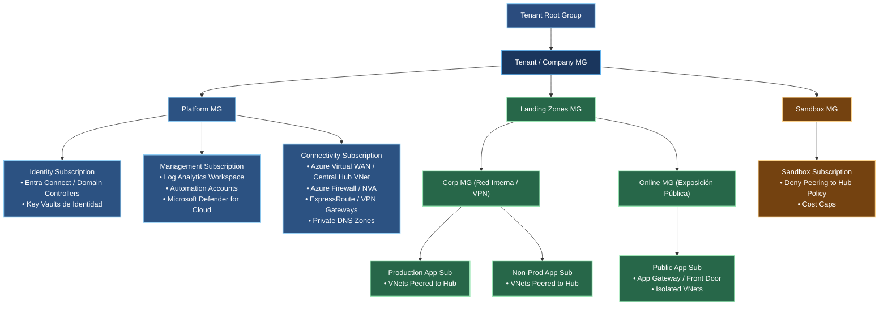
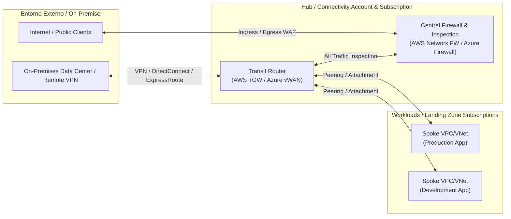

# Arquitectura de Landing Zone en Azure

## Visión general

La Landing Zone en Azure define la estructura organizacional y de suscripciones para apoyar procesos de seguridad, gobernanza, conectividad y workloads dentro de un tenant de Microsoft Entra ID / Azure. Su objetivo es crear un modelo seguro, escalable y consistente desde el inicio, con separación clara entre administración, plataformas compartidas, entornos de negocio y sandbox.

## Organización del tenant y management groups

- Tenant Root Group (TRG): es el nivel superior del tenant. Aquí se definen las políticas globales, la jerarquía de management groups y la estructura base de gobierno de Azure.
- Tenant / Company MG: representa la capa de administración central de la empresa en Azure. Es el punto de coordinación de políticas, seguridad y operaciones.
- Platform MG: concentra los servicios compartidos y la plataforma de soporte de la organización.
  - Identity Subscription: aloja servicios de identidad, autenticación y control de acceso. Incluye Entra Connect / Domain Controllers y Key Vaults de identidad.
  - Management Subscription: centraliza observabilidad, automatización, seguridad y monitoreo. Incluye Log Analytics Workspace, Automation Accounts y Microsoft Defender for Cloud.
  - Connectivity Subscription: agrupa la infraestructura de conectividad. Incluye Azure Virtual WAN / Central Hub VNet, Azure Firewall / NVA, ExpressRoute / VPN Gateways y Private DNS Zones.
- Landing Zones MG: representa la capa de aplicaciones y workloads de la organización.
  - Corp MG (Red Interna / VPN): agrupa aplicaciones internas y entornos con conectividad privada. Incluye Production App Sub y Non-Prod App Sub.
    - Production App Sub: subred o suscripción que aloja aplicaciones en producción conectadas al hub central.
    - Non-Prod App Sub: subred o suscripción de desarrollo y pruebas conectada al hub central.
  - Online MG (Exposición Pública): agrupa aplicaciones y servicios expuestos hacia internet.
    - Public App Sub: suscripción para aplicaciones públicas con App Gateway / Front Door y VNets aisladas.
- Sandbox MG: es el espacio aislado para pruebas y experimentación sin afectar la infraestructura corporativa ni la red central.
  - Sandbox Subscription: cuenta con políticas de aislamiento, bloqueo de peering al hub y límites de costo.

### Siglas y acrónimos utilizados

- MG: Management Group (Grupo de administración).
- TRG: Tenant Root Group (Grupo raíz del tenant).
- VNet: Virtual Network (Red virtual).
- NVA: Network Virtual Appliance (Dispositivo virtual de red).
- VPN: Virtual Private Network (Red privada virtual).
- DNS: Domain Name System (Sistema de nombres de dominio).
- Azure FW: Azure Firewall.
- ExpressRoute: servicio de conectividad privada dedicada a Azure.
- Entra ID: Microsoft Entra ID.
- Key Vault: servicio de almacenamiento seguro de secretos y certificados.
- Log Analytics: servicio de observabilidad y análisis de logs.
- App Gateway: Azure Application Gateway.
- Front Door: Azure Front Door.

## Diagrama principal

## Diagrama de conectividad centralizada

### Explicación del diagrama de conectividad

- Entorno externo / On-Premise: representa la red corporativa o centros de datos remotos que se conectan a la nube mediante VPN, Direct Connect o ExpressRoute.
- Internet / Public Clients: representa clientes públicos o usuarios externos que acceden a servicios expuestos.
- Hub / Connectivity Account & Subscription: es la capa central de conectividad, donde se concentra el tráfico de entrada y salida a la nube.
- Transit Router (AWS TGW / Azure vWAN): actúa como el componente central de interconexión entre redes y workloads. Coordina el tránsito entre las redes de la organización.
- Central Firewall & Inspection: es el punto de inspección de tráfico. Permite aplicar seguridad, filtrado, inspección y control para todo el tráfico antes de llegar a los spokes.
- Workloads / Landing Zone Subscriptions: son los spoke networks o subredes que contienen las aplicaciones productivas y de desarrollo.
- Spoke VPC/VNet (Production App): representa la red de la aplicación en producción conectada al hub para acceder a servicios internos y públicos.
- Spoke VPC/VNet (Development App): representa el entorno de desarrollo con conectividad al hub, pero con políticas y aislamiento adecuadas.

## Explicación por componente del diagrama

### Tenant Root Group (TRG)
Es el primer nivel jerárquico del tenant de Azure. Define la raíz del control administrativo y representa el punto de entrada sobre todas las políticas y grupos de administración.

### Tenant / Company MG
Es el grupo de administración principal de la empresa. Aquí se organiza la estrategia general de seguridad, gobernanza y operación para todos los workloads de Azure.

### Platform MG
Es la capa dedicada a servicios compartidos y de plataforma. Proporciona funciones críticas para toda la organización y evita que cada aplicación tenga que recrear los mismos servicios.

### Identity Subscription
Es la base de identidad y autenticación. Contiene componentes como Entra Connect, controladores de dominio y Key Vaults para secretos y certificados. Esta subscripción permite centralizar la identidad global del tenant.

### Management Subscription
Es la capa de observabilidad y seguridad operativa. Se enfoca en monitoreo, automatización y protección de la nube. Aquí suelen estar Log Analytics, Automation Accounts y Microsoft Defender for Cloud.

### Connectivity Subscription
Es la suscripción de conectividad y networking. Aquí se resuelven la integración entre redes, los gateways de acceso, la inspección de tráfico y la resolución DNS privada. Es la base para acceder a la red corporativa o a internet de manera controlada.

### Landing Zones MG
Es la capa de workloads empresariales. Se divide según el tipo de tráfico o exposición. Aquí se apoya la separación entre aplicaciones internas, públicas y entornos de negocio.

### Corp MG (Red Interna / VPN)
Es el grupo para workloads internos. Su objetivo es separar las aplicaciones que no deben exponerse directamente a internet y que requieren acceso a la red corporativa o redes privadas.

### Production App Sub
Es la suscripción o subred que aloja las aplicaciones en producción. Está conectada al hub central y se diseñan para alta disponibilidad y criticidad operativa.

### Non-Prod App Sub
Es la suscripción para desarrollo, QA o preproducción. Permite validar cambios sin afectar directamente la producción.

### Online MG (Exposición Pública)
Es la capa para servicios con exposición directa a internet. Está diseñada para aplicaciones publicas con front-end y accesos externos.

### Public App Sub
Contiene aplicaciones públicas con servicios como Azure Front Door y Application Gateway, plus una segmentación de redes aisladas para reducir riesgo.

### Sandbox MG
Es el entorno de prueba aislado para experimentación, aprendizaje y validación sin dañar la infraestructura productiva.

### Sandbox Subscription
Cuenta con restricciones de peering con el hub y límites de costo. Se usa para pruebas no críticas y para proyectos que requieran un entorno con reglas estrictas.

## Principios de diseño

- Separación por función y entorno.
- Protección centralizada de identidad y observabilidad.
- Red compartida y servicios comunes bajo una capa de plataforma.
- Aislamiento de workloads según exposición y criticidad.
- Sandbox con políticas restrictivas y control financiero.

## Recomendaciones de operación

1. Mantener la identidad y la seguridad centralizadas en la capa Platform MG.
2. Segmentar workloads por criticidad y tipo de exposición.
3. Centralizar conectividad y control de red en la Connectivity Subscription.
4. Separar producción, no producción y sandbox por diseño.
5. Limitar el acceso y costos del sandbox con políticas estrictas.

## Nota

Esta estructura refleja un modelo de Landing Zone en Azure con separación clara de control, conectividad, workloads y entornos de prueba. El objetivo es mantener una arquitectura gobernable, segura y escalable desde el tenant raíz hasta los workloads finales.
