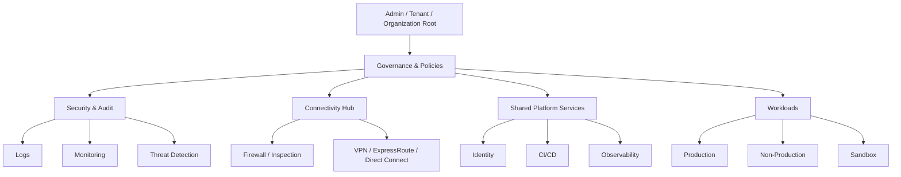
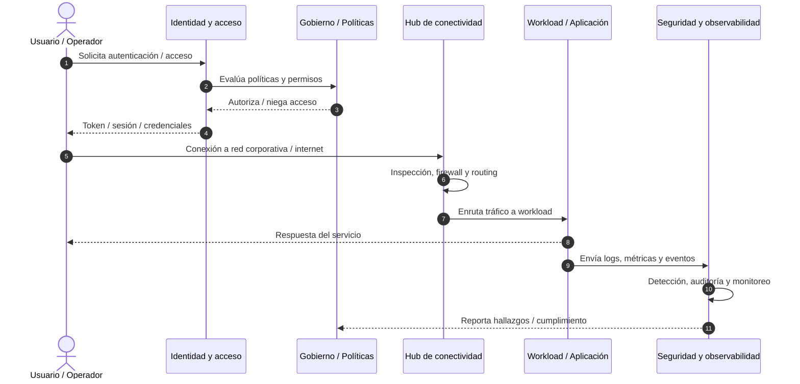
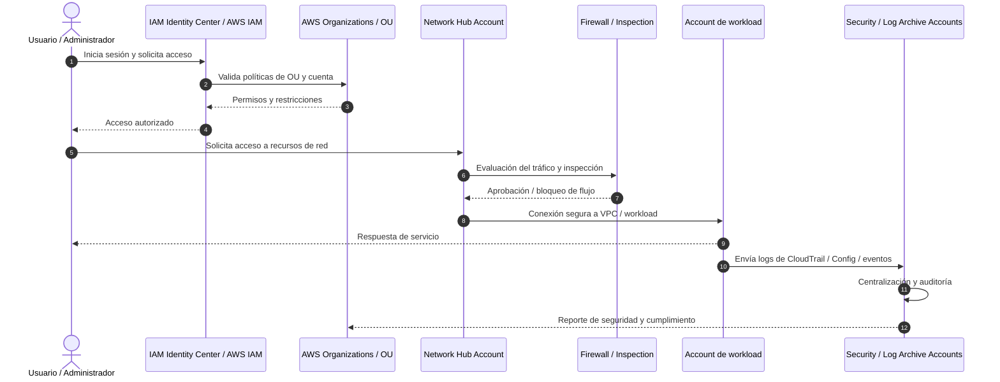
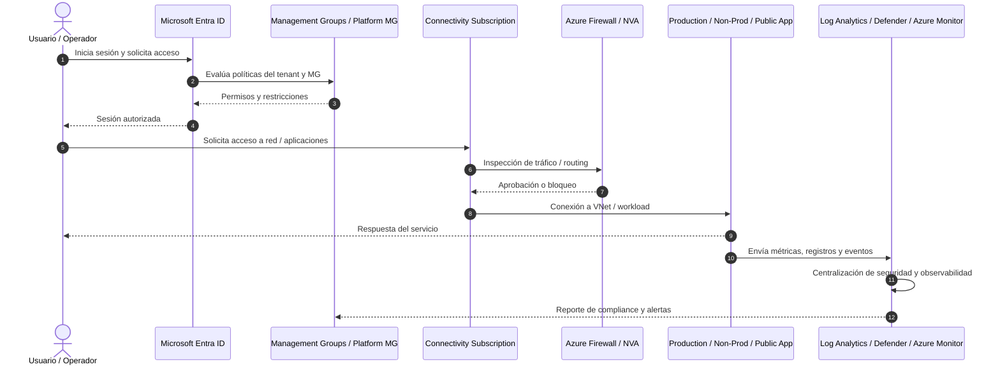

# Landing Zone: elementos comunes y diagramas de secuencia

## 1. Visión general

Las Landing Zones de AWS y Azure comparten un mismo objetivo: crear una base segura, gobernable y escalable para alojar workloads empresariales. En ambos casos, la arquitectura se diseña para separar responsabilidades, reforzar la seguridad y centralizar servicios de red, identidad y observabilidad.

Aunque la terminología cambia entre plataformas, la lógica es equivalente:

- Existe una capa de gobierno y administración.
- Hay una capa de seguridad y auditoría.
- Se centraliza la conectividad y el tránsito de red.
- Los workloads se dividen por criticidad y entorno.
- Se reserva un espacio aislado para pruebas y experimentación.

## 2. Elementos comunes entre ambas Landing Zones

### 2.1 Gobierno centralizado

En ambos modelos existe una jerarquía superior que permite aplicar políticas y controles a toda la organización:

- AWS: Root / AWS Organizations.
- Azure: Tenant Root Group / Management Groups.

Esto permite imponer reglas de seguridad, control de acceso, conectividad y cumplimiento a nivel global.

### 2.2 Seguridad y auditoría centralizadas

La seguridad no se deja distribuida por cada aplicación. En ambos casos, existe una capa dedicada a:

- recaudación y almacenamiento de logs,
- análisis de seguridad,
- detección de amenazas,
- control de acceso,
- trazabilidad de eventos.

Ejemplos equivalentes:

- AWS: Log Archive Account + Security Audit Account.
- Azure: Management Subscription + Identity Subscription.

### 2.3 Conectividad centralizada

Ambas arquitecturas utilizan un hub de conectividad para controlar el tráfico entre:

- internet,
- workloads internos,
- servicios compartidos,
- clientes y usuarios externos.

En ambos casos se incorpora un componente de inspección de tráfico, firewall o control de egress/ingress para centralizar la seguridad de la red.

### 2.4 Separación de workloads por entorno

Las Landing Zones parten de la idea de que no todos los workloads tienen la misma criticidad ni la misma exposición. Por eso se separan por tipo de ambiente:

- Producción.
- No producción / desarrollo / pruebas.
- Sandbox o experimentación.

Esto reduce riesgo, facilita la gobernanza y permite aplicar políticas particulares a cada tipo de entorno.

### 2.5 Servicios compartidos y plataforma

Ambos modelos tienen una capa de plataforma que centraliza servicios reutilizables, por ejemplo:

- repositorios de artefactos,
- runners de CI/CD,
- identidad y autenticación,
- DNS y resolución privada,
- monitorización y seguridad operativa.

Esto evita que cada aplicación construya su propia infraestructura base.

### 2.6 Aislamiento del entorno de pruebas

La presencia de un Sandbox o entorno aislado es un patrón compartido. Este tipo de entorno:

- evita afectar la producción,
- limita riesgos de experimentación,
- permite aprendizaje y validación sin poner en peligro la infraestructura principal,
- puede tener restricciones de red, costos o políticas de acceso.

## 3. Mapa funcional común

Aunque cada proveedor usa nombres distintos, el patrón es equivalente:

## 4. Principios de diseño compartidos

1. Separación por función y entorno.
2. Control centralizado de seguridad, identidad y auditoría.
3. Red de conectividad compartida y controlada.
4. Aislamiento de entornos críticos y no críticos.
5. Reutilización de servicios de plataforma.
6. Protección del entorno productivo ante errores o pruebas.
7. Gobernanza aplicada desde la raíz de la organización.

## 5. Diagrama de secuencia de funcionamiento (patrón general)

Este flujo describe el funcionamiento típico de ambas Landing Zones desde que un usuario o sistema solicita acceso hasta que el tráfico llega a la aplicación y queda registrado para auditoría.

## 6. Diagrama de secuencia de funcionamiento en AWS

### Explicación del flujo AWS

1. El usuario o administrador accede a la plataforma desde IAM Identity Center.
2. AWS Organizations y las políticas de las OU validan la autorización.
3. El tráfico es inspeccionado por el Network Hub Account y el firewall central.
4. La aplicación recibe la solicitud y responde al usuario.
5. Los eventos se envían a Log Archive y Security / Audit Account para observabilidad y cumplimiento.

## 7. Diagrama de secuencia de funcionamiento en Azure

### Explicación del flujo Azure

1. El usuario se autentica con Microsoft Entra ID.
2. Los Management Groups y políticas del tenant validan los permisos.
3. La conectividad central en la Connectivity Subscription revisa y enruta el tráfico.
4. La aplicación produce la respuesta al usuario.
5. La observabilidad centralizada en Log Analytics y Microsoft Defender registra los eventos para gobierno y seguridad.

## 8. Conclusión

La similitud entre AWS y Azure es clara: ambas Landing Zones aplican el mismo patrón de diseño de nube segura. La diferencia está en la nomenclatura y en los servicios específicos de cada proveedor, pero la lógica es la misma:

- gobernar desde arriba,
- centralizar seguridad,
- controlar la red por un hub,
- segmentar workloads,
- monitorizar todo el entorno,
- separar entornos de prueba y producción.

En otras palabras, ambos modelos buscan una nube ordenada, segura, operable y escalable desde el primer día.
